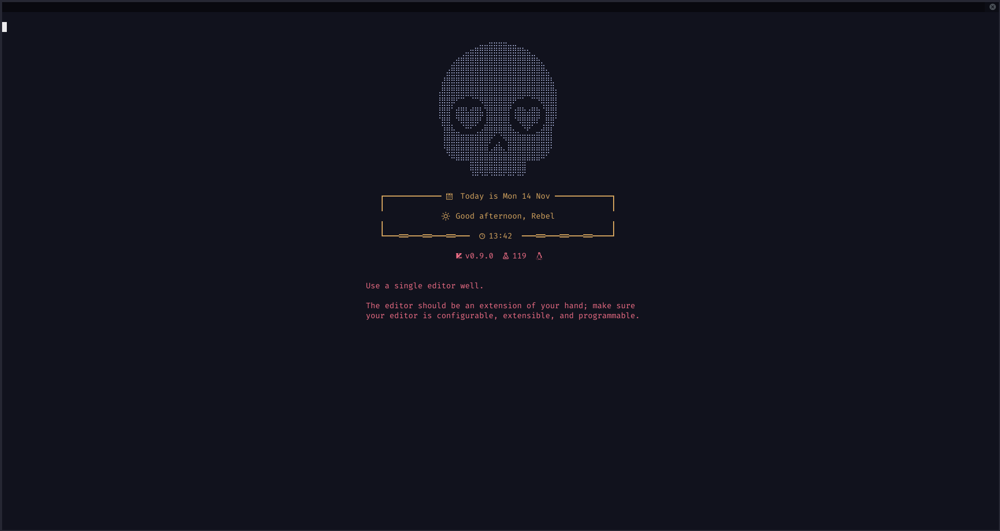
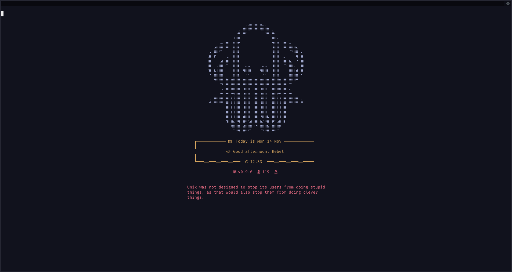
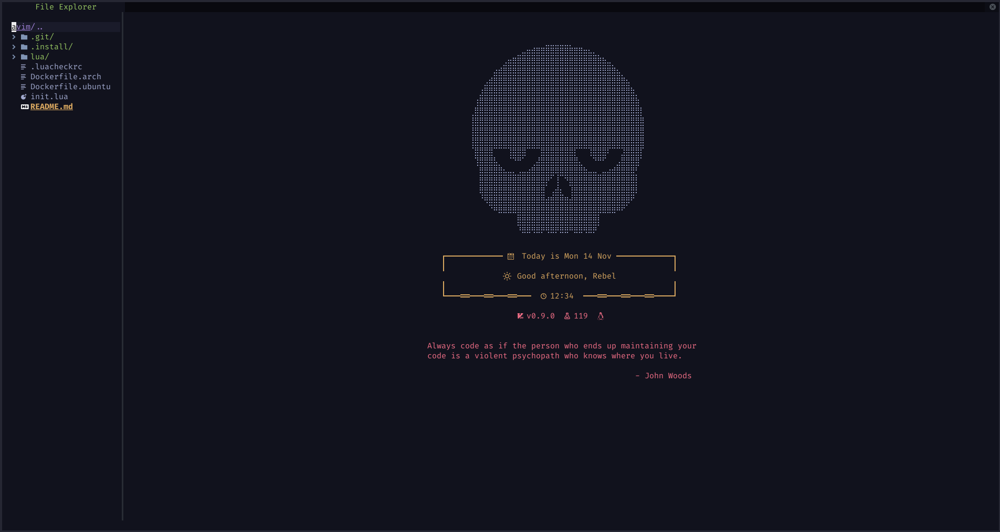
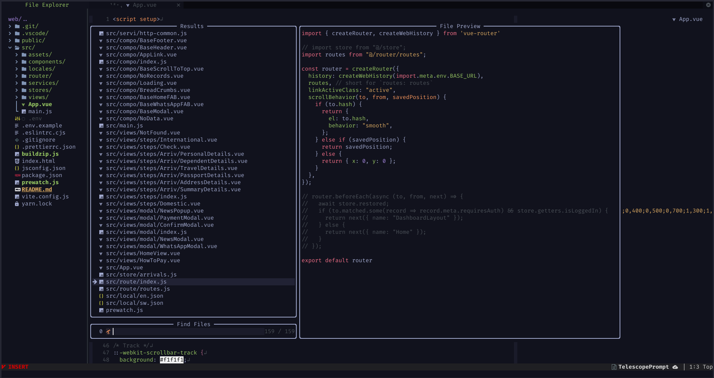

<h1 align="center">AnoNvim</h1>



My kinda bloated W.I.P all-purpose Neovim **P.D.E** Layer. I know very little
about Lua, so I'm learning as I go. It's currently a Frankenstein of different
configs so major cleanups is needed after I understand more about both Lua and
the Neovim API, but so far so good.

It is mostly made for *unix systems, but with _very_ few modifications, can run
just as well in Window systems.

I made it so, it can be run parallel to regular Neovim without interfering with
each other.

Also added executable scrpt for [Neovide](https://neovide.dev) and/or
[Neoray](https://github.com/hismailbulut/Neoray), a GUI (Can be added through a
param in the installer script).

## Installation

```sh
bash <(curl -s https://raw.githubusercontent.com/AnoRebel/AnoNvim/main/.install/installer.sh)
```

- Installer Params:

        Run `-h` or `--help` to get all params, below are some that can be passed as
        environment variables

        - AV_MAIN="main" (default: "main", no other values yet)
        - INTERACTIVE_MODE=1 or `-i` (default: 1, values: 1 || 0)
        - INSTALL_GUI=0 or `-g` (default: 0, values: 1 || 0)

- Then simply run `avim` and the one-time setup will begin. Mason will install
  the rest of the packages on the subsequent launch. After that, just hack away.
- If you added the `-g` or `INSTALL_GUI` params, you have the `gavim` command
  for [Neovide](https://neovide.dev) or
  [Neoray](https://github.com/hismailbulut/Neoray).

## Directory Structure

```lua
├── init.lua
├── lua
│   └── avim
│       ├── autocmds.lua -- (Necessary and unnecessary Auto Commands)
│       ├── core
│       │   ├── defaults.lua -- (AnoNvim default settings)
│       │   ├── init.lua -- (Core AnoNvim setup, including runtime and globals)
│       │   ├── log.lua -- (Custom logger)
│       │   ├── settings.lua -- (Neovim options)
│       │   └── updater.lua -- (Custom AnoNvim updater)
│       ├── icons.lua -- (Collection of icons)
│       ├── lsp
│       │   ├── config.lua -- (LSP configurations)
│       │   └── Other LSP setup config files
│       ├── mappings.lua -- (Default mappings)
│       ├── lazy.lua -- (Lazy initialization and plugin loading)
│       ├── plugins -- (All plugin configurations go in here)
│       │   ├── init.lua -- (Default plugin list)
│       │   ├── alpha.lua
│       │   └── Many other plugin configurations
│       └── utils -- (Utilities needed for smooth sailing; basically a collection of methods that make AnoNvim work)
│           ├── init.lua -- (Necessary and unnecessary Auto Commands)
│           ├── banners.lua -- (Custom banners for Alpha)
│           ├── blame.lua
│           ├── git.lua
│           ├── telescope -- (Custom telescope extension to list toggle terminals)
│           │   ├── _extensions
│           │   │   └── toggleterm.lua
│           │   └── terms.lua
│           └── vmlens.lua
```

## Mappings

- `:Telescope keymaps` or `<leader>fk` (`<leader>` is space key in my config)

## Features

- Themes change according to time of day
- Custom buffer close
- Alpha Logo/Banner change randomly
- Numbers toggle from relative to normal depending on mode
- Etc...

## Plugins

<details><summary>List of some of the installed plugins(Click to expand):</summary>

- [Alpha](https://github.com/goolord/alpha-nvim)
- [Better Escape](https://github.com/max397574/better-escape.nvim)
- [Barbecue](https://github.com/utilyre/barbecue.nvim)
- [Bufferline](https://github.com/akinsho/bufferline.nvim)
- [Codeium.vim](https://github.com/Exafunction/codeium.vim)
- [Codeium.nvim](https://github.com/jcdickinson/codeium.nvim)
- [Completions(Cmp)](https://github.com/hrsh7th/nvim-cmp)
- [Colorizer](https://github.com/NvChad/nvim-colorizer.lua)
- [Comment](https://github.com/numToStr/Comment.nvim)
- [Conflict](https://github.com/akinsho/git-conflict.nvim)
- [Dap](https://github.com/mfussenegger/nvim-dap)
- [Devicons](https://github.com/nvim-tree/nvim-web-devicons)
- [Diffview](https://github.com/sindrets/diffview.nvim)
- [Flutter](https://github.com/akinsho/flutter-tools.nvim)
- [Gitsigns](https://github.com/lewis6991/gitsigns.nvim)
- [Import](https://github.com/miversen33/import.nvim)
- [Incline](https://github.com/b0o/incline.nvim)
- [Indentation](https://github.com/lukas-reineke/indent-blankline.nvim)
- [Leap](https://github.com/ggandor/leap.nvim)
- [LSP](https://github.com/neovim/nvim-lspconfig)
- [Lualine](https://github.com/nvim-lualine/lualine.nvim)
- [Mason](https://github.com/williamboman/mason.nvim)
- [Mini](https://github.com/echasnovski/mini.nvim)
- [Navic](https://github.com/SmiteshP/nvim-navic)
- [Neoclip](https://github.com/AcksID/nvim-neoclip.lua)
- [Neodev](https://github.com/folke/neodev.nvim)
- [Neotest](https://github.com/nvim-neotest/neotest)
- [Notify](https://github.com/rcarriga/nvim-notify)
- [Null LS](https://github.com/jose-elias-alvarez/null-ls.nvim)
- [Numb](https://github.com/nacro90/numb.nvim)
- [NvimTree](https://github.com/nvim-tree/nvim-tree.lua)
- [Lazy](https://github.com/folke/lazy.nvim)
- [Persisted](https://github.com/olimorris/persisted.nvim)
- [Refactoring](https://github.com/ThePrimeagen/refactoring.nvim)
- [Rest APIs](https://github.com/rest-nvim/rest.nvim)
- [Scrollbar](https://github.com/kensyo/nvim-scrlbkun)
- [Spectre](https://github.com/nvim-pack/nvim-spectre)
- [Surround](https://github.com/kylechui/nvim-surround)
- [Symbols Outline](https://github.com/simrat39/symbols-outline.nvim)
- [Tabnine](https://github.com/tzachar/cmp-tabnine)
- [Telescope](https://github.com/nvim-telescope/telescope.nvim)
- [Terminal](https://github.com/akinsho/toggleterm.nvim)
- [ToDo](https://github.com/folke/todo-comments.nvim)
- [Treesitter](https://github.com/nvim-treesitter/nvim-treesitter)
- [Trouble](https://github.com/folke/trouble.nvim)
- [Twilight](https://github.com/folke/twilight.nvim)
- [Which Key](https://github.com/folke/which-key.nvim)
- [WinShift](https://github.com/sindrets/winshift.nvim)
- [Zen](https://github.com/folke/zen-mode.nvim)
- And more... (Total is about 120+ 😁)

</details>

And some other not mentioned here(Like I said, bloat 🤷)

## Gallery Showcase

<details><summary>Images (Click to expand):</summary>








</details>

## Credits

Made from multiple other configs to fit my personal taste with less than minimal
knowledge of lua and Neovim API.

- [CosmicVim](https://github.com/CosmicNvim/CosmicNvim)
- [LunarVim](https://github.com/LunarVim/LunarVim)
- [NvChad](https://github.com/NvChad/NvChad)
- [~~VSNeovim~~ DomacVim](https://github.com/DomacsVim/DomacsVim)
- [b0o's config](https://github.com/b0o/nvim-conf)
- [omega-nvim](https://github.com/max397574/omega-nvim)/[ignis-nvim](https://github.com/max397574/ignis-nvim)
