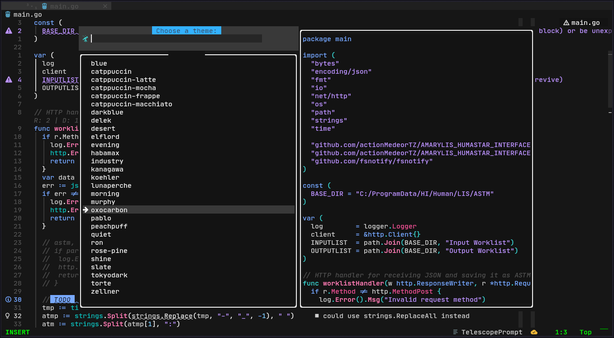

# AnoNvim


A modern, feature-rich Neovim configuration focused on providing a complete development environment. Built with Lua and
designed for extensibility.

## Features

- 🚀 Performance

  - Fast startup with lazy loading
  - Efficient plugin management
  - Optimized file operations
  - Smart caching system

- 🎨 User Interface

  - Dynamic theme switching based on time
  - Beautiful and functional UI components
  - Custom icons and visual elements
  - Random Alpha logos/banners
  - Winbar with context information

- 📝 Development

  - Advanced LSP integration
  - AI coding assistant
    - Codeium
  - Powerful debugging support
  - Git integration with conflict resolution
  - Database integration with Dbee

- 🔧 Tools & Utilities

  - Fuzzy finding with Telescope
  - File tree with NvimTree
  - Terminal integration
  - REST API client
  - Session management
  - Advanced search and replace

- ⚙️ Configuration
  - Type checking and linting
  - Automatic package management
  - Optional GUI support (Neovide/Neoray)
  - Extensive customization options
  - Well-documented codebase

## Requirements

- Neovim >= 0.10.0
- Git >= 2.19.0
- A [Nerd Font](https://www.nerdfonts.com/) (Optional but recommended)
- For optional features:
  - Node.js >= 20
  - Python >= 3.7
  - Go >= 1.20
  - Rust ( >= latest stable)
  - Luarocks

## Installation

```bash
bash <(curl -s https://raw.githubusercontent.com/AnoRebel/AnoNvim/main/.install/installer.sh)
```

### Installation Options

```bash
Options:
    -h, --help                    Print this help message
    -l, --local                   Install local copy of AnoNvim
    -y, --yes                     Automatic yes to prompts
    --overwrite                   Overwrite existing configuration
    --no-install-dependencies     Skip dependency installation
    --neovide                     Install Neovide GUI
    --neoray                      Install Neoray GUI
```

After installation:

1. Run `avim` to start AnoNvim
2. Initial setup will install required plugins

## Directory Structure

```lua
.
├── init.lua                  # Main entry point
├── lua/avim
│   ├── core                  # Core functionality
│   │   ├── defaults.lua      # Default settings
│   │   ├── init.lua          # Core initialization
│   │   ├── log.lua           # Logging system
│   │   └── settings.lua      # Neovim settings
│   ├── commands.lua          # Commands and autocommand definitions
│   ├── health.lua            # Health check
│   ├── icons.lua             # Icon definitions
│   ├── lazy.lua              # Plugin management
│   ├── update.lua            # Update system
│   ├── plugins               # Plugin configurations
│   │   ├── bufferline.lua    # Bufferline(top bar) configurations
│   │   ├── completions.lua   # Code completion configurations
│   │   ├── database.lua      # Database configurations
│   │   ├── editor.lua        # Editor configurations
│   │   ├── explorer.lua      # File explorer configurations
│   │   ├── extras.lua        # Extra plugin configurations
│   │   ├── formatting.lua    # Code formatting configurations
│   │   ├── git.lua           # Git configurations
│   │   ├── lsp.lua           # LSP configurations
│   │   ├── lualine.lua       # Lualine(bottom bar) configurations
│   │   ├── remote.lua        # Remote Coding configurations
│   │   ├── rest.lua          # Rest client configurations
│   │   ├── search.lua        # Search and Replace configurations
│   │   ├── snacks.lua        # Folke's Snacks configurations
│   │   ├── telescope.lua     # Telescope configurations
│   │   ├── themes.lua        # Themes configurations
│   │   ├── treesitter.lua    # Treesitter configurations
│   │   └── ui.lua            # UI components and configurations
│   └── utilities             # Utility functions
```

## Key Bindings

AnoNvim provides multiple ways to explore keybindings:

1. **Keymaps Search**:

   - `:Telescope keymaps` or `<leader>fk`

2. **Which Key**:
   - Press `<leader>` to see available key bindings
   - Context-aware key suggestions

Note: `<leader>` key is mapped to the `Space` key

## Plugin Categories

<details><summary>🧠 AI Assistance</summary>

- [Codeium.nvim](https://github.com/Exafunction/codeium.nvim) - AI code completion

</details>

<details><summary>📝 Editor Enhancement</summary>

- [Alpha](https://github.com/goolord/alpha-nvim) - Startup screen
- [Better Escape](https://github.com/max397574/better-escape.nvim) - Better escape key handling
- [Comment](https://github.com/numToStr/Comment.nvim) - Code commenting
- [Surround](https://github.com/kylechui/nvim-surround) - Text surroundings
- [Which Key](https://github.com/folke/which-key.nvim) - Key binding helper

</details>

<details><summary>🎨 User Interface</summary>

- [Barbecue](https://github.com/Beekaboo/dropbar.nvim) - VS Code-like winbar
- [Bufferline](https://github.com/akinsho/bufferline.nvim) - Buffer line
- [Lualine](https://github.com/nvim-lualine/lualine.nvim) - Status line
- [NeoTree](https://github.com/nvim-neo-tree/neo-tree.nvim) - File explorer
- [Oil](https://github.com/stevearc/oil.nvim) - Buffer-like File explorer
- [Telescope](https://github.com/nvim-telescope/telescope.nvim) - Fuzzy finder

</details>

<details><summary>🛠️ Development Tools</summary>

- [LSP](https://github.com/neovim/nvim-lspconfig) - Language Server Protocol
- [None-LS](https://github.com/nvimtools/none-ls.nvim) - Language Server Protocol (extras)
- [Lazy](https://github.com/folke/lazy.nvim) - Plugin management
- [Mason](https://github.com/williamboman/mason.nvim) - Package management
- [Rest APIs](https://github.com/rest-nvim/rest.nvim) - REST client
- [Persisted](https://github.com/olimorris/persisted.nvim) - Session management
- [Multiple Cursors](https://github.com/brenton-leighton/multiple-cursors.nvim) - Multiple cursors

</details>

<details><summary>📦 Git Integration</summary>

- [Gitsigns](https://github.com/lewis6991/gitsigns.nvim) - Git decorations
- [Diffview](https://github.com/sindrets/diffview.nvim) - Git diff viewer
- [Conflict](https://github.com/akinsho/git-conflict.nvim) - Conflict resolution

</details>

## Gallery

<details><summary>Screenshots (Click to expand)</summary>

  
  


</details>

## Credits

Built upon the great work of:

- [CosmicVim](https://github.com/CosmicNvim/CosmicNvim)
- [LunarVim](https://github.com/LunarVim/LunarVim)
- [NvChad](https://github.com/NvChad/NvChad)
- [DomacsVim](https://github.com/DomacsVim/DomacsVim)
- [b0o's config](https://github.com/b0o/nvim-conf)
- [omega-nvim](https://github.com/max397574/omega-nvim)

## Contributing

Contributions are welcome! Please feel free to submit a Pull Request.

## License

MIT License - see [LICENSE](LICENSE) for more details.
